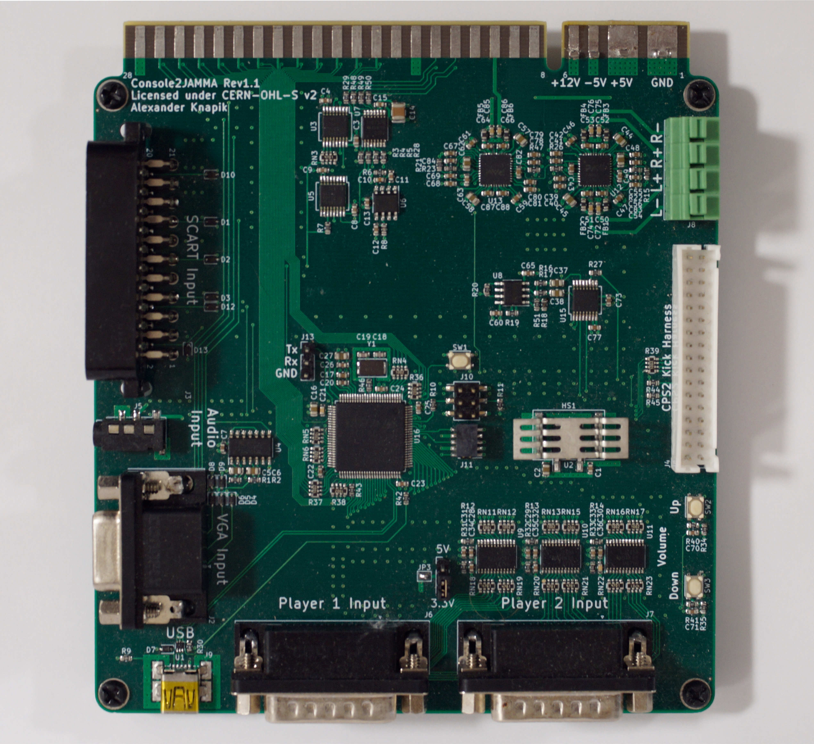

# Console2JAMMA

A system to plug video game consoles into a JAMMA arcade system. 

## Features & Goals
- SCART based RGB or VGA video input. Will work perfectly with any natively RGB or modded console, including the Dreamcast. Handles any sync stripping and CSYNC combination for you with amplified video.
- Works with any arcade cabinet supporting standard JAMMA, "CHAMMA" and the CPS2 kick harness.
- Stereo audio input with selectable mono audio combiner for the JAMMA edge, or an external stereo audio output. Amplified for up to 5 Watts of power and can handle standard arcade 4 Ohm or 8 Ohm speakers.
- Can drive 2 player controller ports for 5V or 3.3V based consoles. Will work with any console that has 12 or fewer IO lines with a modded controller port extension.
- Handy spring terminal controller adapters available for those not comfortable with soldering.
- Single player USB output to support PS3 or XBox360 too.

## Progress
This is still heavily a work in progress. I've built up the first hardware prototype and identified some issues that I would like to address. However I am mainly still testing the hardware.

There is also no firmware currently written yet. This is what would need to be addressed next before any further hardware prototypes are designed.
